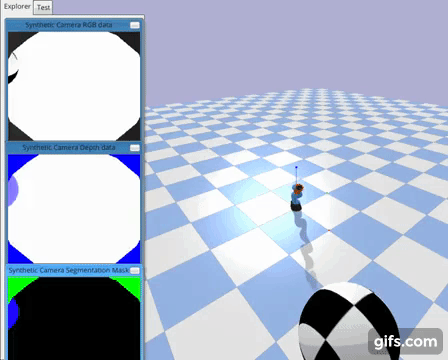

# Active Vision
Requirements -
1. pybullet (pip install pybullet)
2. gym (pip install gym)
3. baselines (https://github.com/openai/baselines)
4. tensorboard_logger (https://github.com/TeamHG-Memex/tensorboard_logger)
5. PyTorch
6. TensorFlow

To install gym environment -  
cd active-vision  
pip install -e .  

Sample Results:

Robot learns to explore the environment to find the target object and then stay focused on it.

Once the target object is in sight, robot is robust to perturbations

